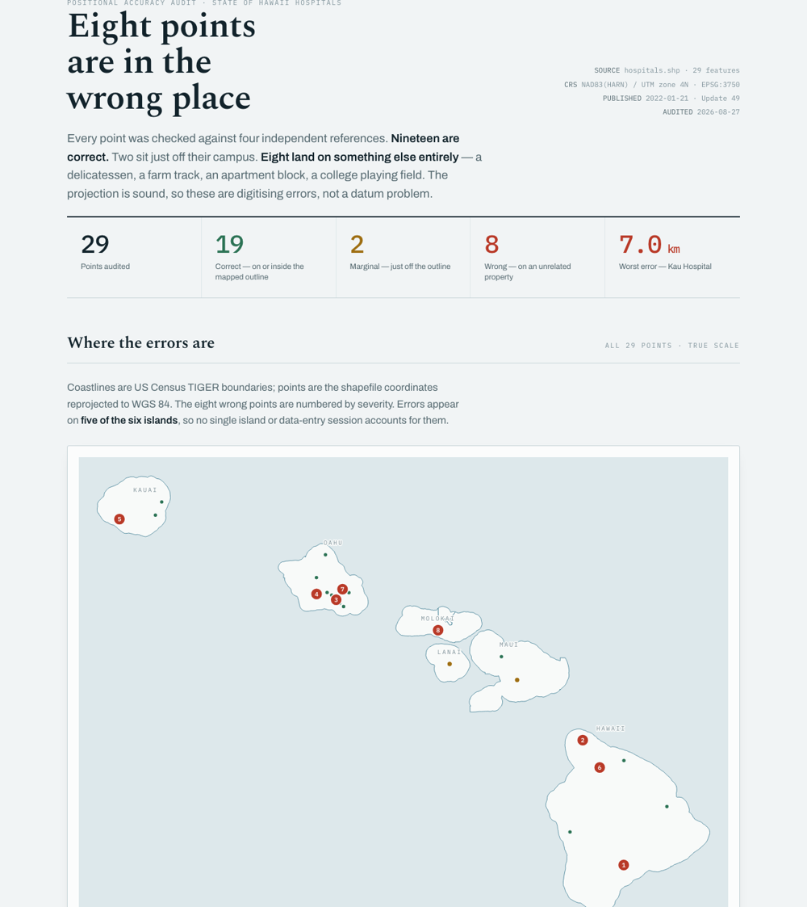
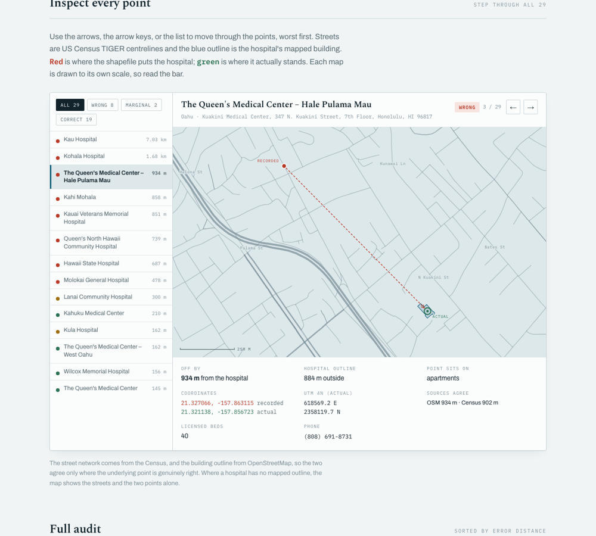
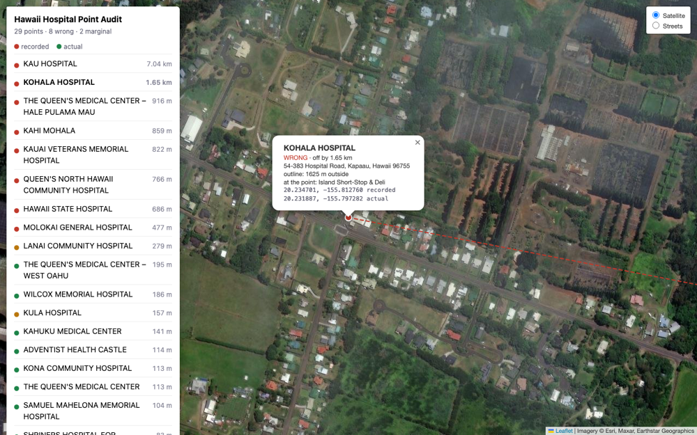
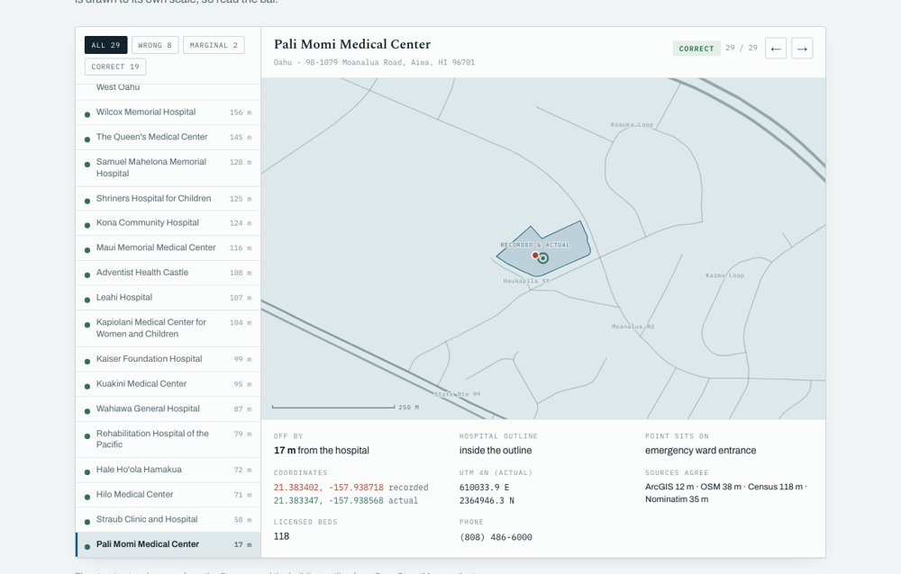

# GIS Skills

[](LICENSE)
[](https://claude.com/claude-code)
[](https://developers.openai.com/codex)

Agent skills for geospatial work. Each skill is a self-contained folder: instructions an agent
reads, plus scripts it runs. Maintained by [KZN Consulting](https://kznconsulting.com).

## Table of contents

- [Skills](#skills)
- [How it works](#how-it-works)
- [Requirements](#requirements)
- [Installation](#installation)
  - [macOS and Linux](#macos-and-linux)
  - [Windows](#windows)
  - [Verifying the install](#verifying-the-install)
- [Usage](#usage)
- [Data sources](#data-sources)
- [Troubleshooting](#troubleshooting)
- [Contributing](#contributing)
- [License](#license)

## Skills

| Skill | What it does |
|---|---|
| [`geo-point-audit`](skills/geo-point-audit) | Checks whether the points in a layer actually sit where they claim to, and publishes a street-level report with corrected coordinates |

### geo-point-audit

Point layers rot quietly. Somebody digitises a facility by eye, snaps it to the wrong building, or
drops it on the road centreline instead of the site, and the error survives every republication
because nothing downstream ever checks.

Hand this skill a `.shp`, `.geojson`, or `.csv` of facilities and it verifies every point against
four independent references, then publishes an audit artifact.

On a 29-point state hospital layer it found **8 points on the wrong property** — one 7 km out on a
farm track, another on a delicatessen, a third on a college playing field.



**What you get**

- An overview chart of every point on real coastlines, coloured by verdict
- An interactive inspector to step through each point at street level
- A full audit table: offset, footprint test, and what physically stands at the recorded coordinate
- Corrected coordinates in WGS 84 **and** the layer's own CRS, ready to write back



**Two outputs, deliberately.** The artifact above is the shareable deliverable: self-contained,
private, works offline, no tile server involved. `build_live_map.py` also writes a plain Leaflet
page for local use, where satellite imagery settles in one second what a building outline argues
for in a paragraph.



Above: the Kohala Hospital point sitting on a roadside deli, with the error vector running east
toward the real hospital. Use the artifact to tell people what you found; use the live map to
convince yourself first.

## How it works

**Agreement across independent sources.** A coordinate is only as trustworthy as the number of
independent sources that agree with it. One geocoder can be wrong. Three geocoders, plus a building
outline, plus a reverse lookup of what physically stands at the coordinate cannot all be wrong the
same way.

**Consensus by cluster, not by average.** Candidate locations are clustered and the largest cluster
wins. Geocoders fail badly rather than gradually — three will agree within 40 m and a fourth will
land 3 km away. An average lets that outlier drag the result and the audit then reports a fake
error with total confidence, which is the worst failure this tool can have.

**The footprint test outranks distance.** A point on the correct building can still sit 210 m from
the centre of a large campus, while a point 162 m out can be on a neighbour's lot. Distance alone
ranks those backwards.



A pass looks like this: both markers inside the building outline, 17 m apart, and the recorded
coordinate reverse-geocodes to the hospital's own emergency entrance.

**On the property, not just near it.** Close to the right building is not the same as inside the
parcel. A point in the road right-of-way passes every distance test and is still dropped by any
parcel join — on the reference layer, 7 of the 19 points that originally passed reverse-geocode to
a street rather than a site. Points on roads are flagged automatically; supply parcel boundaries
with `check_parcels.py` and the audit tests containment properly and proposes a coordinate
guaranteed inside the boundary.

**Systematic shift is checked first.** If every bad point moves the same way by the same amount,
the finding is "your CRS handling is wrong", not "these points are wrong" — a completely different
repair, and reporting the individual points would send you chasing symptoms.

**Independent basemap layers.** Streets come from the US Census and building outlines from
OpenStreetMap, on purpose. Where the two agree, that agreement is real corroboration rather than
one source repeating itself.

## Requirements

- [`uv`](https://docs.astral.sh/uv/) — the only prerequisite. Scripts fetch their own Python
  dependencies per run, so there is nothing to install or keep in sync.
- An agent that loads skills: [Claude Code](https://claude.com/claude-code) or
  [Codex](https://developers.openai.com/codex).
- Optional: Google Chrome, used to render and verify the report before publishing.

No API keys. Every data source is free at audit volumes.

## Installation

### macOS and Linux

Install `uv` if you do not already have it:

```bash
brew install uv
```

Clone the repository:

```bash
git clone https://github.com/kznconsulting/gis-skills.git ~/Code/gis-skills
```

Link the skill into Claude Code:

```bash
ln -sfn ~/Code/gis-skills/skills/geo-point-audit ~/.claude/skills/geo-point-audit
```

Or into Codex:

```bash
ln -sfn ~/Code/gis-skills/skills/geo-point-audit ~/.codex/skills/geo-point-audit
```

Symlinking rather than copying means `git pull` updates the skill in place.

### Windows

Install `uv` in PowerShell:

```powershell
winget install --id=astral-sh.uv -e
```

Clone the repository:

```powershell
git clone https://github.com/kznconsulting/gis-skills.git $HOME\Code\gis-skills
```

Link the skill with a **directory junction**, which works without administrator rights or
Developer Mode:

```powershell
cmd /c mklink /J "$HOME\.claude\skills\geo-point-audit" "$HOME\Code\gis-skills\skills\geo-point-audit"
```

If you have Developer Mode enabled you can use a real symlink instead:

```powershell
New-Item -ItemType SymbolicLink -Path "$HOME\.claude\skills\geo-point-audit" -Target "$HOME\Code\gis-skills\skills\geo-point-audit"
```

Copying the folder also works, but you then lose updates from `git pull`.

The scripts are pure Python and run identically on Windows. Text I/O is pinned to UTF-8 throughout
rather than left to the platform default, because place names carry ʻokina, macrons, and accents
that a legacy Windows code page cannot represent — an unpinned run corrupts names on read and
fails outright on write. `corrections.csv` is written with a BOM so Excel reads those names
correctly rather than as mojibake.

Only two things differ from the macOS instructions in `SKILL.md`, and both are shell conventions
rather than requirements:

| | macOS / Linux | Windows |
|---|---|---|
| Path variable | `S=~/.agents/skills/...` | `$S = "$HOME\...\skills\..."` |
| Chrome (for verification) | `/Applications/Google Chrome.app/Contents/MacOS/Google Chrome` | `C:\Program Files\Google\Chrome\Application\chrome.exe` |

The `--headless=new --screenshot` flags are identical on both.

### Verifying the install

Ask your agent to list its available skills, and check that `geo-point-audit` appears. Or just
hand it a dataset — the skill is written to trigger on phrasing like *"are these coordinates
right"*, *"the pins look off"*, or *"QA this shapefile"*, without you naming it.

## Usage

Point your agent at a dataset in plain language:

> These hospital locations look wrong to me — can you verify them? `~/Downloads/hospitals`

The agent runs the pipeline, reads the findings, writes the report copy, and publishes the
artifact. Budget roughly four seconds per point, most of it spent waiting on rate-limited
geocoders.

To drive the pipeline yourself, see [`SKILL.md`](skills/geo-point-audit/SKILL.md) for the run
order. Every script takes `--help`, and each step caches its output, so a failed network call
costs you that step and nothing else.

Deeper reference material, loaded by the agent only when needed:

| Document | Covers |
|---|---|
| [`check_parcels.py`](skills/geo-point-audit/scripts/check_parcels.py) | The parcel-containment test, run it with your own boundary file |
| [`methodology.md`](skills/geo-point-audit/references/methodology.md) | Verdict rules, thresholds, and what the audit cannot tell you |
| [`data-sources.md`](skills/geo-point-audit/references/data-sources.md) | Every endpoint, its parameters, and its quirks |
| [`troubleshooting.md`](skills/geo-point-audit/references/troubleshooting.md) | Verifying the artifact, plus the traps that cost real time |

## Data sources

All free, no API keys at audit volumes.

| Source | Role |
|---|---|
| [US Census Geocoder](https://geocoding.geo.census.gov/) | Address-range interpolation |
| [ArcGIS World Geocoder](https://developers.arcgis.com/rest/geocode/) | Rooftop-level matches |
| [Nominatim](https://nominatim.org/) | Forward and reverse geocoding (OpenStreetMap) |
| [Overpass](https://overpass-api.de/) | Building outlines (OpenStreetMap) |
| [OSM core API](https://wiki.openstreetmap.org/wiki/API_v0.6) | Building outlines when Overpass is unavailable |
| [Census TIGERweb](https://tigerweb.geo.census.gov/) | Street network and boundaries |

These are volunteer-funded shared services. The skill clusters queries into small bounding boxes
(741 km² instead of 158,000 km² on the test layer), paces requests, and backs off on HTTP 429
rather than stampeding the mirrors. Please keep it that way if you fork it.

**Coverage outside the United States is reduced.** The Census sources are US-only, so the audit
falls back to OpenStreetMap and ArcGIS. The report states this rather than presenting a weaker
evidence base as the full one.

## Troubleshooting

**Overpass queries fail or hang.** The public instances are frequently overloaded — they were down
for hours during this skill's development. The skill tries three mirrors, then falls back to the
**OSM core API**, which is separate infrastructure behind openstreetmap.org and considerably more
reliable. Building outlines still arrive; only the server-side tag filter is lost, so the script
filters locally instead. Re-running also resumes from where it stopped.

**A point is reported as unmatched.** Name matching is deliberately strict, because loose matching
once paired "Ka'u Hospital" with "Kauai Veterans Memorial Hospital" and produced a confident 530 km
error. Unmatched points are written to `name_map.json` with candidate names listed; fill it in and
re-run.

**Everything is flagged wrong.** Check the bearings line in `findings.md` first. Clustered bearings
mean a datum or projection fault in the source layer, not 30 individual mistakes.

**No geocode matched.** Confirm the address column was detected correctly — `load_points.py` prints
which field it chose, and `--addr-field` overrides it.

## Contributing

Issues and pull requests welcome. If you add a skill, keep the shape: a `SKILL.md` that explains
*why* as well as *what*, scripts that are resumable and fail loudly, and reference docs an agent
loads only when it needs them.

## License

[MIT](LICENSE) © KZN Consulting
